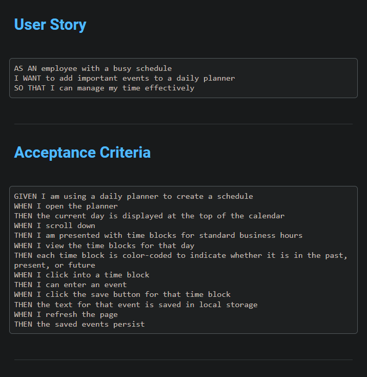
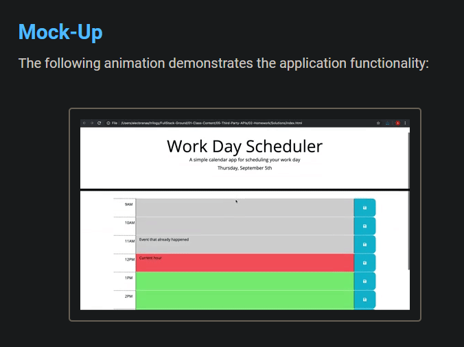
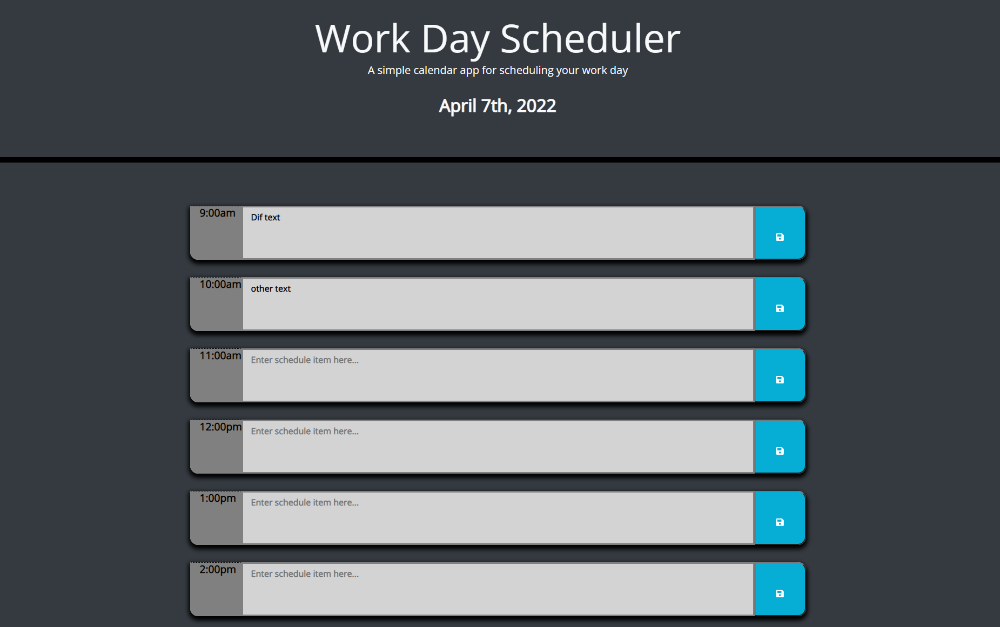

# Drop Calender

## Requirements

- User story and Requirements

  

- Mock-up

  

## Deployed Page

- Deployed page screenshot

## Goals

- [X] Display timeblocks for standard business hours 

- [X] Timeblocks will have a input field and a save button

- [X] The save button will store the timeblock information in local storage

- [X] The calender will display the current day above the timeblocks

- [X] The timeblocks will be color-coded to indicate past, present, and future events

## Resources used

- jQuery API - https://jquery.com/

- Bootstrap - https://getbootstrap.com/

- Font Awesome - https://fontawesome.com/

- Moment.js - https://momentjs.com/
